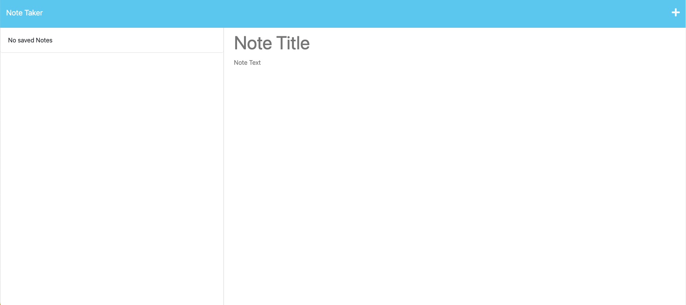
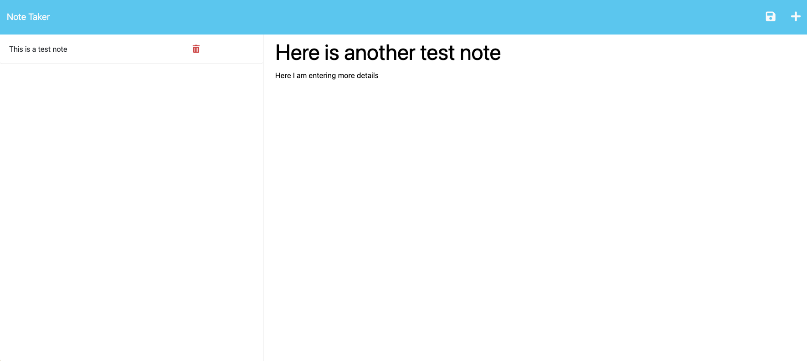

  

# Basic Note Taker App

  
  
  ## Table of Contents

  

  
  
  
  
  
  
  

## Description
A basic note taker that allows the user to create new notes with a header and a body.  The notes are stored within a database file and persists across page loads.  The notes can also be deleted as they are completed.  This was created as a part of the UC-Irvine coding bootcamp.  
Starter code was received from:
 
https://github.com/coding-boot-camp/miniature-eureka
 
The following user story were also provided:
 
### User Story
AS A small business owner   
I WANT to be able to write and save notes  
SO THAT I can organize my thoughts and keep track of tasks I need to complete

### Acceptance Criteria
GIVEN a note-taking application  
WHEN I open the Note Taker  
THEN I am presented with a landing page with a link to a notes page  
WHEN I click on the link to the notes page  
THEN I am presented with a page with existing notes listed in the left-hand column, plus empty fields to enter a new note title and the note’s text in the right-hand column  
WHEN I enter a new note title and the note’s text  
THEN a Save icon appears in the navigation at the top of the page  
WHEN I click on the Save icon  
THEN the new note I have entered is saved and appears in the left-hand column with the other existing notes  
WHEN I click on an existing note in the list in the left-hand column  
THEN that note appears in the right-hand column  
WHEN I click on the Write icon in the navigation at the top of the page  
THEN I am presented with empty fields to enter a new note title and the note’s text in the right-hand column  

(<a href="#back_to_top">back to top</a>)

## Installation
No installation needed.  This is a live web app run on a Heroku server.  However, if you wanted to run this on your local machine, you can easily clone the repo, run "npm i" to install dependencies and then run "node server".

(<a href="#back_to_top">back to top</a>)

## Usage
This is a great tool for keeping track of notes and daily tasks. For clarity, screenshots of the final product are below:
 

 

(<a href="#back_to_top">back to top</a>)

## Contributing
Contributions are always welcome.  Feel free to push up any suggestions and the creator would be happy to review them!

(<a href="#back_to_top">back to top</a>)

## Tests
No tests on this project.

(<a href="#back_to_top">back to top</a>)

## License
MIT License

Copyright (c) 2023 ultimated1228

Permission is hereby granted, free of charge, to any person or organization
obtaining a copy of the software and accompanying documentation covered by
this license (the "Software") to use, reproduce, display, distribute,
execute, and transmit the Software, and to prepare derivative works of the
Software, and to permit third-parties to whom the Software is furnished to
do so, all subject to the following:

The copyright notices in the Software and this entire statement, including
the above license grant, this restriction and the following disclaimer,
must be included in all copies of the Software, in whole or in part, and
all derivative works of the Software, unless such copies or derivative
works are solely in the form of machine-executable object code generated by
a source language processor.

THE SOFTWARE IS PROVIDED "AS IS", WITHOUT WARRANTY OF ANY KIND, EXPRESS OR
IMPLIED, INCLUDING BUT NOT LIMITED TO THE WARRANTIES OF MERCHANTABILITY,
FITNESS FOR A PARTICULAR PURPOSE, TITLE AND NON-INFRINGEMENT. IN NO EVENT
SHALL THE COPYRIGHT HOLDERS OR ANYONE DISTRIBUTING THE SOFTWARE BE LIABLE
FOR ANY DAMAGES OR OTHER LIABILITY, WHETHER IN CONTRACT, TORT OR OTHERWISE,
ARISING FROM, OUT OF OR IN CONNECTION WITH THE SOFTWARE OR THE USE OR OTHER
DEALINGS IN THE SOFTWARE.

Fore more details on the [MIT License](https://opensource.org/licenses/MIT) please click the link!

(<a href="#back_to_top">back to top</a>)

## Contact
You can get in touch with the creator through:

[My Github](https://github.com/ultimated1228)

[Email the creator](mailto:stevenlucasmeyer@gmail.com)

(<a href="#back_to_top">back to top</a>)
